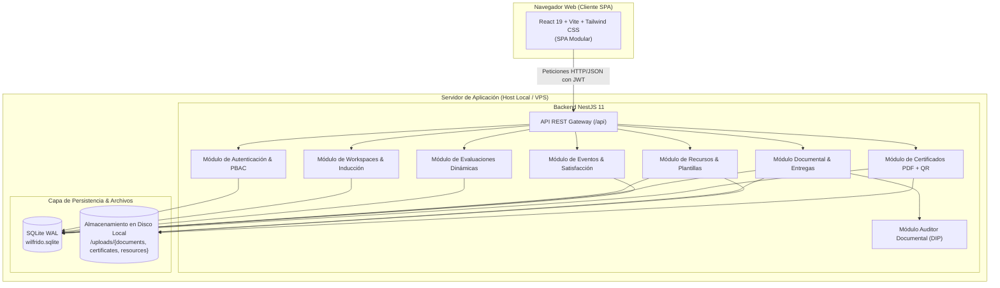

# Arquitectura del Sistema y Visión General

## 1. Propósito y Alcance del Sistema

La plataforma privada y soberana para el **Ing. Wilfrido Trujillo** es un sistema web integral diseñado para centralizar y automatizar los tres ejes sustantivos de gestión académica y vinculación institucional:

1. **Prácticas Preprofesionales:** Control de matrícula, inducción obligatoria guiada por video, evaluación diagnóstica de comprensión normativa, descarga de formatos institucionales y recepción de bitácoras e informes.
2. **Vinculación con la Sociedad:** Seguimiento de proyectos comunitarios, bitácoras periódicas y validación de evidencias de campo.
3. **Conferencias, Talleres y Eventos de Difusión:** Portal de acceso ligero mediante código QR para asistentes presenciales o virtuales, descarga inmediata de diapositivas, captura de encuestas de satisfacción con métricas agregadas en tiempo real y emisión automatizada de certificados de participación en formato PDF con firma digital y verificación criptográfica QR.

Adicionalmente, el sistema incorpora un **Agente Auditor Documental Heurístico** que analiza automáticamente los documentos en formato PDF cargados por los estudiantes para validar legibilidad de texto, estructura académica conforme al Régimen Académico (RRA), número de páginas y presencia de secciones obligatorias antes o durante la revisión docente.

---

## 2. Principios de Diseño Arquitectónico

El sistema se rige bajo los siguientes principios técnicos de ingeniería de software:

* **Soberanía y Aislamiento de Datos (Self-Hosted):** Todo el estado y los artefactos residen en el servidor local del docente, eliminando la dependencia de servicios SaaS de terceros que comprometan la privacidad de las evaluaciones y expedientes académicos.
* **Separación de Responsabilidades y Arquitectura en Capas:**
  * **Backend:** Arquitectura modular desacoplada en tres capas mediante NestJS (Controladores delgados, Servicios de lógica de dominio, Repositorios TypeORM).
  * **Frontend:** Arquitectura Modular por Dominios de Negocio (Domain-Driven Modules) sobre React 19 y Vite, con aislamiento estricto entre dominios.
* **Inversión de Dependencias (DIP):** Los componentes de alta volatilidad (motores de evaluación, auditoría documental, proveedores de hashing) se desacoplan mediante interfaces TypeScript abstractas y tokens de inyección de dependencias (`DOCUMENT_AUDITOR`).
* **Eficiencia Extrema de Recursos (Zero-Daemon):** Persistencia en SQLite embebido con modo WAL (Write-Ahead Logging), eliminando el consumo de memoria de servidores de bases de datos independientes para optimizar entornos con 1 GB de RAM.
* **Contratos REST Limpios:** Respuestas directas con cargas útiles puras y manejo estandarizado de excepciones bajo la especificación RFC 7807.

---

## 3. Topología de Componentes del Sistema (Diagrama C4)



---

## 4. Matriz de Decisiones Técnicas y Justificación

| Área Técnica | Tecnología Seleccionada | Alternativa Evaluada | Justificación de Ingeniería |
| :--- | :--- | :--- | :--- |
| **Backend Runtime** | Node.js 22+ / NestJS 11 | Express plano / Fastify | NestJS provee inyección de dependencias nativa, modularidad formal, validación declarativa con DTOs y tipado estricto sin necesidad de configurar middleware manual. |
| **Persistencia** | SQLite WAL (`better-sqlite3`) | PostgreSQL / MySQL | Consumo de memoria RAM de 10 a 20 MB (frente a 100-160 MB de un daemon PostgreSQL). Concurrencia de lectura no bloqueante mediante WAL. Toda la base de datos se almacena en un archivo único portable. |
| **ORM** | TypeORM 1.1+ | Prisma / Dapper | Integración nativa con NestJS (`@nestjs/typeorm`), tipado relacional explícito mediante `Relation<T>`, soporte de columnas JSON complejas (`simple-json`) y portabilidad directa a PostgreSQL sin refactorización de código. |
| **Frontend Runtime** | React 19 + Vite | Next.js 15 | Eliminación completa de sobrecarga de memoria por Server-Side Rendering (0 MB de RAM Node en el servidor para servir archivos estáticos). Tiempos de HMR inferiores a 50 ms. Sin problemas de hidratación en cliente. |
| **Estilos CSS** | Tailwind CSS v4 + Vanilla CSS | CSS Modules / Styled Components | Utilidades atómicas de compilación rápida con motor Oxide, sin clases CSS no utilizadas en el bundle final y consistencia visual mediante diseño oscuro técnico. |
| **Motor de PDF** | `pdfkit` | Puppeteer / HTML-to-PDF | Generación vectorial directa en memoria en menos de 50 ms, sin necesidad de levantar navegadores Chromium en segundo plano que consumirían cientos de megabytes de RAM. |
| **Generación QR** | `qrcode` | Servicios API de terceros | Generación soberana y desconectada de matrices QR como buffers de imagen incrustables directamente en el PDF y en interfaces web. |
| **Auditoría Documental** | `pdf-parse` + Heurística RRA | OCR pesado / Tesseract local | Extracción instantánea de texto, metadatos internos y conteo de páginas en memoria sin dependencias binarias pesadas de C++, desacoplada bajo la interfaz `IDocumentAuditor`. |

---

## 5. Estructura del Monorepo

El proyecto se gestiona como un espacio de trabajo unificado mediante `pnpm workspaces`:

```text
wilfrido_trujillo/
├── package.json             # Scripts de orquestación (dev, build, lint)
├── pnpm-workspace.yaml      # Definición de paquetes (backend, frontend)
├── .gitignore               # Reglas de exclusión y retención de .gitkeep
├── docs/                    # Documentación técnica modular Docs-as-Code
├── backend/                 # API REST NestJS 11
│   ├── src/
│   │   ├── common/          # Filtros globales RFC 7807, decoradores, interceptores
│   │   ├── database/        # Configuración TypeORM y SQLite WAL
│   │   ├── users/           # Entidad de usuario e identidades
│   │   ├── auth/            # Controladores, servicios, JWT y guardias PBAC
│   │   ├── workspaces/      # Espacios académicos, matrículas y seguimiento de inducción
│   │   ├── tests/           # Evaluaciones dinámicas en JSON e intentos de calificación
│   │   ├── resources/       # Plantillas, formatos oficiales y descarga condicional
│   │   ├── submissions/     # Buzón de entregas, estados y retroalimentación docente
│   │   ├── events/          # Portal público de eventos y encuestas de satisfacción
│   │   ├── certificates/    # Motor de certificados PDF y validación criptográfica QR
│   │   └── auditor/         # Agente auditor documental desacoplado (IDocumentAuditor)
│   ├── data/                # Archivo de base de datos wilfrido.sqlite
│   └── uploads/             # Archivos físicos clasificados por módulo
└── frontend/                # Aplicación cliente React 19 + Vite
    └── src/
        ├── app/             # Rutas declarativas y proveedores globales
        ├── shared/          # UI Kit atómico, cliente Axios tipado y utilidades
        └── modules/         # Módulos de dominio aislados (auth, admin, practicas, vinculacion, eventos)
```
