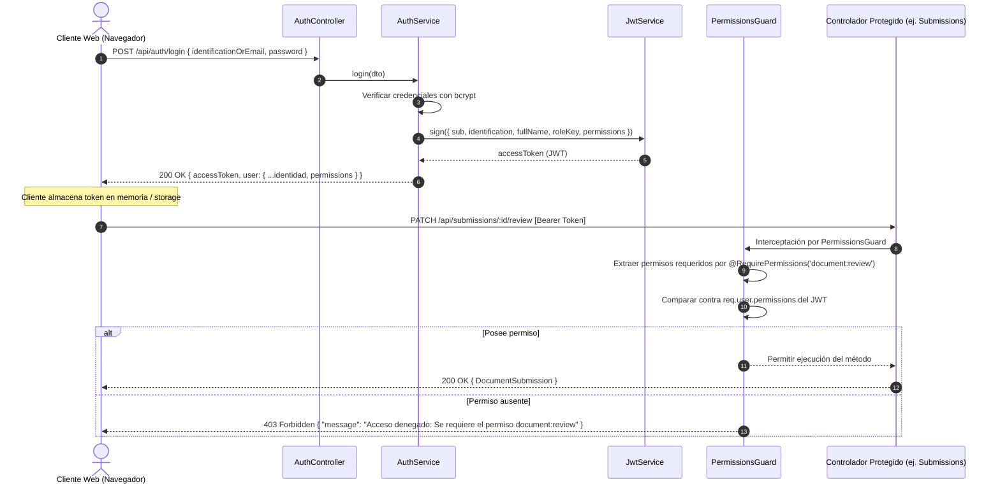

# Modelo de Seguridad y Control de Acceso Basado en Permisos (PBAC)

## 1. Fundamentos del Enfoque Desacoplado (Permissions-First)

El sistema implementa una arquitectura de **Control de Acceso Basado en Permisos (Permission-Based Access Control - PBAC)** desacoplada por completo de los nombres literales de los roles.

### Justificación de Ingeniería:
En entornos académicos, los nombres y jerarquías de roles suelen sufrir mutaciones operativas (ejemplo: *"Ingeniero"*, *"Coordinador de Carrera"*, *"Tutor Institucional"*, *"Docente Revisor"*, *"Estudiante Regular"*, *"Pasante"*). Condicionar la lógica de negocio a comparaciones de cadenas directas como `if (user.role === 'ADMIN')` o `@Roles('INGENIERO')` introduce deuda técnica severa y obliga a refactorizar controladores y componentes cada vez que cambia una designación administrativa.

### Principio Rector:
* **El código solo evalúa capacidades atómicas:** Ni el backend ni el frontend validan roles en tiempo de ejecución para conceder acceso a una acción. En su lugar, validan la posesión de una **capacidad o permiso específico** (ejemplo: `document:review`, `workspace:create`, `certificate:issue`).
* **Los Roles como Agrupadores Configurables:** Un rol es únicamente una etiqueta contenedora que agrupa un arreglo de permisos en la base de datos (`permissionsJson`).

---

## 2. Catálogo Universal de Permisos del Sistema

El catálogo de permisos está definido formalmente en el backend (`Permission` enum) y replicado estrictamente en los tipos del frontend:

| Permiso Atómico | Código de Identificación | Descripción Técnica de la Capacidad |
| :--- | :--- | :--- |
| **Creación de Espacios** | `workspace:create` | Capacidad para crear nuevos espacios académicos o de conferencias. |
| **Modificación de Espacios** | `workspace:update` | Capacidad para editar directrices, enlaces de inducción y estado activo. |
| **Eliminación de Espacios** | `workspace:delete` | Capacidad para archivar o eliminar espacios de trabajo. |
| **Lectura de Espacios** | `workspace:read` | Capacidad para visualizar espacios en los que el usuario se encuentra matriculado o activos. |
| **Gestión de Recursos** | `resource:manage` | Capacidad para cargar plantillas oficiales, formatos normativos y eliminar recursos. |
| **Descarga de Recursos** | `resource:download` | Capacidad para descargar archivos y formatos de trabajo oficiales. |
| **Gestión de Evaluaciones** | `test:manage` | Capacidad para estructurar bancos de preguntas, criterios de calificación y rubricas. |
| **Rendición de Evaluaciones** | `test:take` | Capacidad para presentar evaluaciones diagnósticas y registrar intentos. |
| **Entrega de Documentos** | `document:submit` | Capacidad para enviar evidencias, bitácoras e informes académicos. |
| **Revisión de Documentos** | `document:review` | Capacidad para auditar entregas, emitir dictamen y redactar retroalimentación docente. |
| **Gestión de Certificados** | `certificate:manage` | Capacidad para emitir, revocar y configurar certificados oficiales con código QR. |
| **Reclamo de Certificados** | `certificate:claim` | Capacidad para registrar asistencia y solicitar emisión de constancia digital. |

---

## 3. Flujo de Autenticación y Autorización



---

## 4. Implementación en el Backend (NestJS)

### 4.1 Decorador Declarativo `@RequirePermissions`
Ubicación: `backend/src/auth/decorators/require-permissions.decorator.ts`
```typescript
import { SetMetadata } from '@nestjs/common';
import { Permission } from '../enums/permission.enum.js';

export const PERMISSIONS_KEY = 'permissions';
export const RequirePermissions = (...permissions: Permission[]) =>
  SetMetadata(PERMISSIONS_KEY, permissions);
```

### 4.2 Guardia de Autorización `PermissionsGuard`
Ubicación: `backend/src/auth/guards/permissions.guard.ts`
El guardia recupera los metadatos inyectados mediante `Reflector` y verifica que el arreglo de permisos del usuario autenticado contenga la totalidad de los permisos requeridos por el método o clase:

```typescript
@Injectable()
export class PermissionsGuard implements CanActivate {
  constructor(private readonly reflector: Reflector) {}

  canActivate(context: ExecutionContext): boolean {
    const requiredPermissions = this.reflector.getAllAndOverride<Permission[]>(
      PERMISSIONS_KEY,
      [context.getHandler(), context.getClass()],
    );

    if (!requiredPermissions || requiredPermissions.length === 0) {
      return true;
    }

    const { user } = context.switchToHttp().getRequest();
    if (!user || !user.permissions) {
      throw new ForbiddenException('Acceso denegado: El usuario no cuenta con permisos registrados.');
    }

    const hasPermission = requiredPermissions.every((permission) =>
      user.permissions.includes(permission),
    );

    if (!hasPermission) {
      throw new ForbiddenException(
        `Acceso denegado: No posees los privilegios requeridos para ejecutar esta acción (${requiredPermissions.join(', ')}).`,
      );
    }

    return true;
  }
}
```

---

## 5. Implementación en el Frontend (React 19)

El cliente web implementa componentes y hooks declarativos que leen el estado de permisos unificado del contexto de autenticación:

### 5.1 Hook `usePermission`
Permite evaluar programáticamente capacidades para condicionales de renderizado o deshabilitación de controles:
```typescript
export function usePermission(permission: Permission): boolean {
  const { user } = useAuth();
  if (!user || !user.permissions) return false;
  return user.permissions.includes(permission);
}
```

### 5.2 Componente Estructural `<Can>`
Permite ocultar o mostrar bloques enteros de interfaz de usuario de forma limpia y declarativa:
```tsx
<Can permission="document:review">
  <button onClick={openReviewModal}>
    Revisar Entregas
  </button>
</Can>
```
