# Modelo Entidad-Relación y Persistencia SQLite WAL

## 1. Fundamentos del Motor de Base de Datos

El sistema utiliza **SQLite 3** mediante el driver de alto rendimiento `better-sqlite3`, integrado con TypeORM 1.1+. La configuración se optimizó para servidores privados (VPS) de especificaciones acotadas (1 GB de memoria RAM), implementando el modo **WAL (Write-Ahead Logging)**.

### Ventajas Técnicas Demostradas:
* **Cero Daemons Independientes (Zero-Daemon):** El motor se ejecuta en el mismo espacio de memoria del proceso Node.js, consumiendo entre 10 MB y 20 MB de memoria RAM en reposo (en contraste con los 90 a 160 MB requeridos por daemons PostgreSQL o MySQL).
* **Concurrencia de Lectura No Bloqueante:** Mediante `PRAGMA journal_mode = WAL;`, los procesos de lectura operan concurrentemente sin ser bloqueados por transacciones de escritura.
* **Integridad Referencial Estricta:** Se activa de forma forzada `PRAGMA foreign_keys = ON;` al momento de inicializar la conexión para garantizar la validez de las claves foráneas y la eliminación en cascada.
* **Serialización Nativa de JSON:** Se aprovechan las columnas de tipo `simple-json` de TypeORM para esquemas dinámicos como bancos de preguntas, respuestas de evaluaciones y resultados del auditor documental, sin sobrecostos de tablas intermedias.

---

## 2. Diagrama Entidad-Relación (Mermaid)

```mermaid
erDiagram
    User ||--o{ WorkspaceEnrollment : "se matricula en"
    Workspace ||--o{ WorkspaceEnrollment : "contiene"
    Workspace ||--o{ ResourceFile : "posee plantillas"
    Workspace ||--o{ Test : "define evaluaciones"
    Workspace ||--o{ Certificate : "emite"
    Workspace ||--o{ EventFeedback : "recibe encuestas"
    
    Test ||--o{ TestAttempt : "registra intentos"
    User ||--o{ TestAttempt : "rinde"
    
    WorkspaceEnrollment ||--o{ DocumentSubmission : "realiza entregas"

    User {
        string id PK "UUID"
        string email UK "Correo único institucional"
        string identification UK "Cédula / Identificación alfanumérica"
        string fullName "Nombres y apellidos completos"
        string roleKey "Etiqueta clasificadora (INGENIERO, ESTUDIANTE)"
        simple_json permissionsJson "Arreglo de permisos PBAC"
        string passwordHash "Hash generado con bcrypt (costo 10)"
        datetime createdAt "Fecha de registro"
        datetime updatedAt "Fecha de actualización"
    }

    Workspace {
        string id PK "UUID"
        string title "Nombre descriptivo del espacio"
        string description "Directrices e instrucciones generales"
        string type "Tipo de espacio (PRACTICAS, VINCULACION, EVENTO)"
        string accessCode UK "Código unívoco (ej. PRAC-2026, CONF-IA)"
        string inductionVideoUrl "URL de inducción (YouTube / Vimeo)"
        boolean isActive "Indicador de disponibilidad"
        datetime createdAt "Fecha de creación"
        datetime updatedAt "Fecha de actualización"
    }

    WorkspaceEnrollment {
        string id PK "UUID"
        string userId FK "Referencia a User"
        string workspaceId FK "Referencia a Workspace"
        string status "Estado (active, completed, dropped)"
        boolean inductionVideoWatched "Inducción visualizada al 100%"
        boolean testPassed "Evaluación diagnóstica aprobada"
        datetime enrolledAt "Fecha de inscripción"
        datetime completedAt "Fecha de finalización de ciclo"
    }

    ResourceFile {
        string id PK "UUID"
        string workspaceId FK "Referencia a Workspace"
        string title "Denominación del recurso o plantilla"
        string description "Descripción del contenido"
        string fileUrl "Ruta o nombre físico del archivo en uploads"
        string fileType "Mime-type o formato (PDF, DOCX, XLSX)"
        integer fileSize "Tamaño en bytes"
        boolean isLockedUntilTestPass "Bloqueado hasta aprobar inducción"
        datetime createdAt "Fecha de carga"
    }

    Test {
        string id PK "UUID"
        string workspaceId FK "Referencia a Workspace"
        string title "Título de la evaluación"
        string description "Instrucciones de resolución"
        integer minimumScore "Puntaje mínimo aprobatorio (base 10)"
        simple_json questionsJson "Banco de preguntas y opciones"
        datetime createdAt "Fecha de creación"
        datetime updatedAt "Fecha de actualización"
    }

    TestAttempt {
        string id PK "UUID"
        string testId FK "Referencia a Test"
        string userId FK "Referencia a User"
        integer score "Calificación obtenida (0 a 10)"
        boolean isPassed "Indicador de aprobación"
        simple_json answersJson "Respuestas seleccionadas por el alumno"
        datetime createdAt "Fecha de rendición del intento"
    }

    DocumentSubmission {
        string id PK "UUID"
        string enrollmentId FK "Referencia a WorkspaceEnrollment"
        string documentTitle "Denominación de la entrega o evidencia"
        string fileUrl "Nombre físico del archivo PDF en uploads"
        string status "Estado (submitted, observed, approved)"
        string feedbackNotes "Observaciones redactadas por el docente"
        integer auditScore "Puntaje de auditoría heurística (0 a 100)"
        simple_json auditResult "Estructura del análisis y semáforo RRA"
        datetime auditedAt "Fecha de auditoría"
        datetime approvedAt "Fecha de aprobación final"
        datetime createdAt "Fecha de carga"
        datetime updatedAt "Fecha de modificación"
    }

    Certificate {
        string id PK "UUID"
        string workspaceId FK "Referencia a Workspace"
        string recipientName "Nombres y apellidos del participante"
        string recipientEmail "Correo electrónico del titular"
        string recipientIdentification "Cédula de identidad"
        integer hours "Horas académicas acreditadas"
        string topicTitle "Tema del taller o conferencia"
        string verificationHash UK "Hash público unívoco (WT-XXXX-XXXX-XXXX)"
        string pdfUrl "Ruta relativa del PDF generado"
        datetime issuedAt "Fecha de expedición oficial"
        datetime createdAt "Fecha de registro"
    }

    EventFeedback {
        string id PK "UUID"
        string workspaceId FK "Referencia a Workspace"
        string attendeeName "Nombre del asistente encuestado"
        string attendeeEmail "Correo del asistente"
        string attendeeIdentification "Cédula del asistente"
        integer rating "Calificación general (1 a 5 estrellas)"
        string comments "Comentarios y sugerencias de mejora"
        datetime createdAt "Fecha de registro de la encuesta"
    }
```



---

## 3. Integración en `DatabaseModule`

La definición central de entidades se centraliza en `backend/src/database/database.module.ts`:

```typescript
export const ENTITIES = [
  User,
  Workspace,
  WorkspaceEnrollment,
  ResourceFile,
  Test,
  TestAttempt,
  DocumentSubmission,
  Certificate,
  EventFeedback,
];
```

Al iniciar la aplicación en modo desarrollo (`NODE_ENV !== 'production'`), TypeORM sincroniza automáticamente los esquemas sin pérdida de datos en el archivo local `./data/wilfrido.sqlite`.
