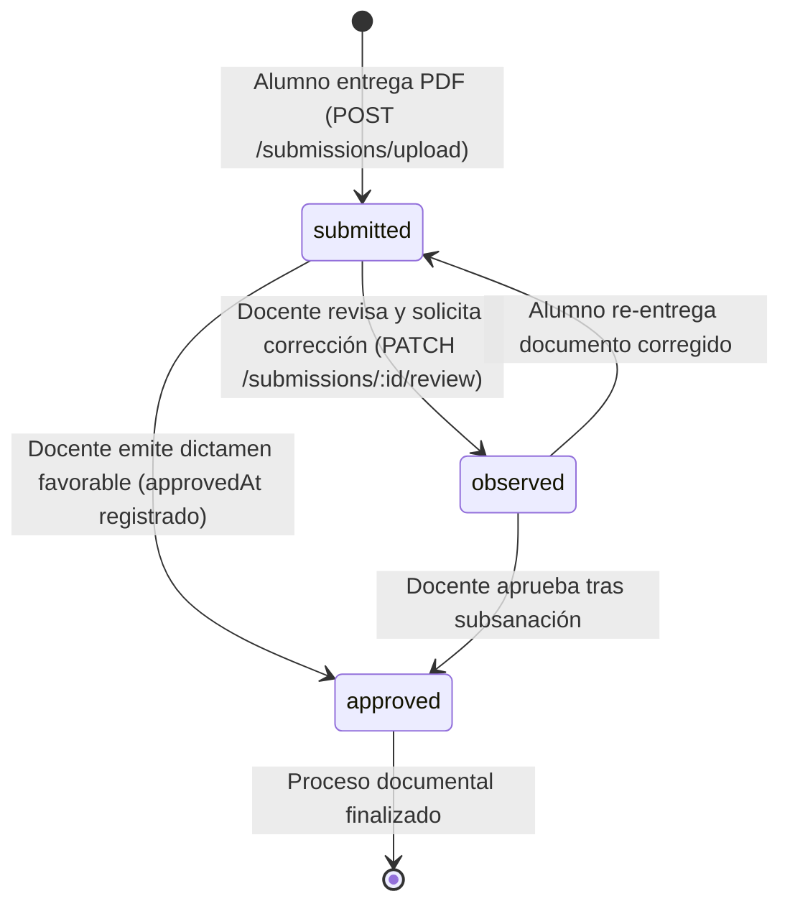

# Módulo Documental y Bandeja de Entregas (`/api/submissions`)

## 1. Descripción del Módulo

El módulo `SubmissionsModule` gestiona el buzón de recepción de evidencias estudiantiles (bitácoras semanales, convenios firmados e informes finales de prácticas o vinculación). Los documentos se almacenan localmente en disco bajo una estructura segura (`uploads/documents/`), se enlazan a la matrícula del alumno y transitan por un ciclo de vida formal de tres estados: `'submitted'`, `'observed'` y `'approved'`.

---

## 2. Ciclo de Vida de los Estados de Entrega



---

## 3. Catálogo de Endpoints

### 3.1 Carga de Documento de Entrega
* **Método y Ruta:** `POST /api/submissions/upload`
* **Permiso Requerido:** `document:submit`
* **Formato:** `multipart/form-data`
* **Validaciones Previas:**
  1. El usuario debe estar matriculado en el espacio de trabajo.
  2. Debe haber completado la inducción en video al 100% (`inductionVideoWatched === true`).
  3. Debe haber aprobado la evaluación diagnóstica (`testPassed === true`).
* **Parámetros:**
  * `workspaceId` (string, UUID): Identificador del espacio.
  * `documentTitle` (string): Denominación de la entrega (ej. *Informe Final de Prácticas*).
  * `file` (archivo binario): Archivo PDF (máximo 30 MB).
* **Auto-Auditoría Heurística:** Si el archivo recibido es un PDF, el servicio ejecuta de forma transparente el análisis heurístico inmediato, calculando y persistiendo `auditScore` y `auditResult` en el mismo guardado.
* **Respuestas:**
  * `201 Created`: Devuelve la entidad `DocumentSubmission`.
  * `400 Bad Request`: Si no cumple los requisitos previos de inducción o falta el archivo.

---

### 3.2 Consulta de Entregas del Estudiante Autenticado
* **Método y Ruta:** `GET /api/submissions/my-submissions/:workspaceId`
* **Permiso Requerido:** `document:submit`
* **Respuestas:** `200 OK` (Arreglo de entregas con fecha, estado y observaciones docentes recibidas).

---

### 3.3 Bandeja de Entregas del Espacio (Revisión Docente)
* **Método y Ruta:** `GET /api/submissions/workspace/:workspaceId`
* **Permiso Requerido:** `document:review`
* **Descripción:** Devuelve la totalidad de entregas del espacio con datos del estudiante (nombre, cédula, correo), fecha de entrega, puntaje de auditoría heurística y estado actual.
* **Respuestas:** `200 OK` (Arreglo de `DocumentSubmission[]`).

---

### 3.4 Dictamen y Retroalimentación Docente
* **Método y Ruta:** `PATCH /api/submissions/:id/review`
* **Permiso Requerido:** `document:review`
* **Payload de Entrada (`ReviewSubmissionDto`):**
  ```json
  {
    "status": "approved",
    "feedbackNotes": "El informe cumple con todos los objetivos y horas registradas satisfactoriamente."
  }
  ```
* **Lógica del Estado:**
  * Si `status === 'approved'`: Asigna `approvedAt = new Date()`.
  * Si `status === 'observed'`: Requiere `feedbackNotes` no vacío para que el estudiante conozca qué aspectos subsanar.
* **Respuestas:** `200 OK` (Entidad actualizada).

---

### 3.5 Descarga de Documento Entregado
* **Método y Ruta:** `GET /api/submissions/:id/download`
* **Acceso:** Autenticado.
* **Seguridad:** Únicamente autorizada si el usuario es el dueño de la entrega o cuenta con el permiso `document:review`.
* **Respuestas:** `200 OK` (Stream binario del archivo original).
