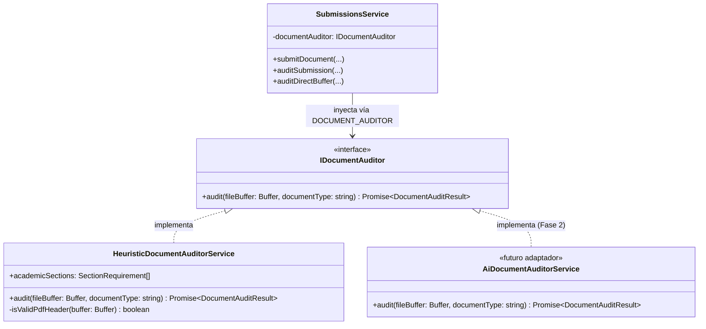

# Módulo Auditor Documental Heurístico (`/api/auditor`)

## 1. Principio de Inversión de Dependencias (DIP) y Diseño Pluggable

El módulo `AuditorModule` desacopla el motor de análisis y validación documental mediante una abstracción formal, garantizando que el sistema no dependa rígidamente de librerías concretas ni de proveedores específicos de Inteligencia Artificial:



---

## 2. Contrato de la Interfaz `IDocumentAuditor`

Ubicación: `backend/src/auditor/interfaces/document-auditor.interface.ts`

```typescript
export type AuditStatus = 'passed' | 'warning' | 'rejected';

export interface DocumentAuditResult {
  isValid: boolean;
  score: number;                   // Puntaje ponderado de 0 a 100
  status: AuditStatus;             // Semáforo: 'passed' (verde), 'warning' (amarillo), 'rejected' (rojo)
  numPages: number;                // Conteo real de páginas legibles
  characterCount: number;          // Total de caracteres de texto extraídos
  missingFields: string[];         // Códigos de secciones normativas ausentes
  observations: string[];          // Lista de hallazgos y sugerencias explicativas
  metadata?: {
    title?: string;
    author?: string;
    creator?: string;
    producer?: string;
    creationDate?: string;
  };
  rawAnalysis?: Record<string, unknown>;
}

export interface IDocumentAuditor {
  audit(fileBuffer: Buffer, documentType?: string): Promise<DocumentAuditResult>;
}

export const DOCUMENT_AUDITOR = 'IDocumentAuditor';
```

---

## 3. Criterios de Evaluación del Motor Heurístico (Fase 1)

El servicio `HeuristicDocumentAuditorService` ejecuta un análisis estático multifactorial sobre el buffer del PDF:

| Factor Evaluado | Condición de Aprobación | Penalización / Hallazgo |
| :--- | :--- | :--- |
| **Cabecera Mágica del Archivo** | Los primeros 5 bytes deben corresponder a `%PDF-` (`0x25 0x50 0x44 0x46 0x2D`). | Si falla, se declara inválido inmediatamente con puntaje 0 y estado `'rejected'`. |
| **Extensión de Páginas** | Para informes formales, se exige un mínimo de 2 páginas. | Deducción de 20 puntos y observación de longitud insuficiente. |
| **Densidad y Legibilidad OCR** | Al menos 80 caracteres totales y promedio de 100 caracteres por página. | Si tiene < 80 caracteres: deducción de 40 puntos (`'texto_ocr_legible'`) advirtiendo sobre escaneos físicos sin OCR. |
| **Datos Informativos (RRA)** | Detección de términos: `estudiante`, `cédula`, `carrera`, `periodo`, `universidad`, `facultad`. | Deducción de 15 puntos si no se detectan datos de identificación. |
| **Objetivos de la Práctica** | Detección de términos: `objetivo`, `objetivos`, `objetivo general`. | Deducción de 20 puntos si la sección no figura. |
| **Actividades y Horas** | Detección de términos: `actividad`, `actividades`, `desarrollo`, `horas`. | Deducción de 20 puntos si no se detallan actividades. |
| **Conclusiones y Resultados** | Detección de términos: `conclusión`, `conclusiones`, `recomendación`, `resultados`. | Deducción de 10 puntos si no figuran reflexiones finales. |
| **Legalización y Firmas** | Detección de términos: `firma`, `firmado`, `tutor`, `docente`, `aprobado`. | Deducción de 10 puntos si no se encuentran indicios de firma. |
| **Metadatos del Documento** | Presencia de título y autor en propiedades internas del PDF (evitar `Untitled`). | Deducción de 5 puntos por metadatos ausentes o nombres genéricos. |

### Criterio del Semáforo Final:
* **Verde (`'passed'`):** $\text{Score} \ge 80$ y sin secciones obligatorias ausentes.
* **Amarillo (`'warning'`):** $50 \le \text{Score} < 80$ o detección de secciones ausentes subsanables.
* **Rojo (`'rejected'`):** $\text{Score} < 50$, archivo ilegible o corrupto.

---

## 4. Endpoints de Auditoría

### 4.1 Auditoría de Entrega Existente
* **Método y Ruta:** `POST /api/submissions/:id/audit`
* **Acceso:** Docente (`document:review`) o Estudiante titular.
* **Descripción:** Lee el archivo PDF almacenado en disco, ejecuta el análisis heurístico, persiste `auditScore` y `auditResult` en la base de datos y devuelve el dictamen.
* **Respuestas:**
  * `200 OK`:
    ```json
    {
      "submission": {
        "id": "sub-1234",
        "auditScore": 90,
        "auditedAt": "2026-09-29T20:25:00.000Z"
      },
      "auditResult": {
        "isValid": true,
        "score": 90,
        "status": "passed",
        "numPages": 4,
        "characterCount": 3540,
        "missingFields": [],
        "observations": [
          "El documento cumple con todos los criterios de estructura formal y legibilidad."
        ]
      }
    }
    ```

---

### 4.2 Pre-Auditoría de Documento en Memoria (Buzón Estudiantil)
* **Método y Ruta:** `POST /api/submissions/audit-preview`
* **Acceso:** Autenticado.
* **Formato:** `multipart/form-data` (`file`, `documentType`).
* **Descripción:** Analiza el buffer en memoria en tiempo real **sin guardar el archivo en disco ni registrar la entrega**, permitiendo al alumno conocer su diagnóstico antes de confirmar el envío.
* **Respuestas:** `200 OK` (Objeto `DocumentAuditResult`).
