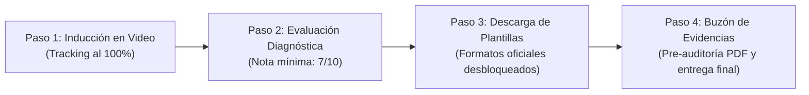

# Experiencia y Flujo de Trabajo del Estudiante

## 1. Visión General del Proceso Secuencial

Para evitar entregas prematuras o incumplimientos del Régimen Académico (RRA), el módulo de prácticas y vinculación impone un **embudo pedagógico de 4 fases progresivas**:

---

## 2. Componentes Clave del Flujo

### 2.1 Reproductor de Video de Inducción con Listener de Finalización
* **Ubicación:** `frontend/src/modules/practicas/components/InductionVideoPlayer.tsx`
* **Comportamiento:**
  * Incrusta el video institucional configurado por el docente en YouTube o Vimeo.
  * Supervisa el estado de reproducción mediante la API de eventos del reproductor.
  * Al llegar al 100% de la duración, emite automáticamente una llamada al endpoint `POST /api/workspaces/:id/induction/complete`.
  * La interfaz actualiza la tarjeta con una insignia verde de verificación y desbloquea el Paso 2 (Evaluación Diagnóstica).

---

### 2.2 Motor de Evaluación Interactiva (`QuestionnaireTest.tsx`)
* **Ubicación:** `frontend/src/modules/practicas/components/QuestionnaireTest.tsx`
* **Comportamiento:**
  * Renderiza preguntas de opción múltiple de forma limpia y accesible.
  * Valida que todas las interrogantes cuenten con una selección antes de permitir el envío.
  * Al hacer clic en *"Entregar Evaluación"*, procesa las respuestas en el servidor (`POST /api/tests/:id/submit`).
  * Despliega inmediatamente el resultado obtenido (puntaje sobre 10 puntos) con animación y retroalimentación de estado:
    * **Aprobado ($\ge 7$ pts):** Desbloquea de forma permanente las plantillas normativas y el buzón de entrega de bitácoras.
    * **Reprobado ($< 7$ pts):** Permite reiniciar el cuestionario de inmediato para una nueva oportunidad.

---

### 2.3 Tarjetas de Recursos Desbloqueables (`ResourceCard.tsx`)
* **Ubicación:** `frontend/src/modules/practicas/components/ResourceCard.tsx`
* **Comportamiento:**
  * Si el examen no ha sido aprobado, muestra el botón de descarga inhabilitado acompañado de un ícono de candado y la advertencia: *"Completa la inducción obligatoria para descargar esta plantilla"*.
  * Al aprobar, el botón se activa en azul y ejecuta la descarga autenticada con nombre limpio del archivo (`documentsApi.download`).

---

### 2.4 Buzón Drag-and-Drop con Pre-Auditoría en Vivo (`DocumentDropzone.tsx`)
* **Ubicación:** `frontend/src/modules/practicas/components/DocumentDropzone.tsx`
* **Comportamiento:**
  1. Permite arrastrar y soltar o explorar un archivo PDF de entrega en el equipo.
  2. **Pre-Auditoría RRA con el Asistente Heurístico:**
     * Al seleccionar el archivo, aparece el botón *"Pre-auditar ahora"*.
     * Llama al endpoint `POST /api/submissions/audit-preview` enviando el archivo en memoria.
     * Muestra una tarjeta con el semáforo preliminar:
       * **Verde (Apto):** *"Cumple con la estructura oficial"* ($>80$ pts).
       * **Amarillo (Observaciones):** Alerta al estudiante sobre secciones faltantes (ej. falta objetivos o firmas) antes de que el docente lo revise.
       * **Rojo (Crítico):** Alerta si el archivo está corrupto o es un escaneo sin OCR legible.
  3. Al confirmar el envío (`POST /api/submissions/upload`), el documento pasa formalmente a la bandeja de revisión docente con estado `'submitted'`.
