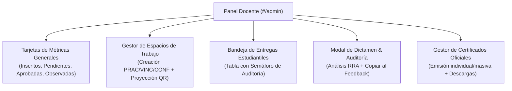

# Panel Docente y Administración del Sistema

## 1. Visión General del Panel de Control (`#/admin`)

El panel administrativo es la consola central para el **Ing. Wilfrido Trujillo**, accesible únicamente para usuarios con permisos docentes y de supervisión (`workspace:create`, `document:review`, `certificate:manage`).

---

## 2. Componentes Principales del Módulo Administrativo

### 2.1 Bandeja de Entregas Estudiantiles (`SubmissionsReviewTable.tsx`)
* **Ubicación:** `frontend/src/modules/admin/components/SubmissionsReviewTable.tsx`
* **Características:**
  * Filtros rápidos por estado: *Todas*, *Pendientes*, *Observadas*, *Aprobadas* con conteo numérico en tiempo real.
  * Datos completos del estudiante remitente (nombre y cédula de identidad).
  * **Columna de Auditoría Heurística:**
    * Si la entrega ya fue analizada, despliega un badge con semáforo y puntaje numérico (ej. `90/100 pts` en verde, `70/100 pts` en amarillo o `45/100 pts` en rojo).
    * Si no ha sido analizada, muestra la etiqueta *"Pendiente"*.
  * Botones de acción rápida: Descarga directa del PDF entregado y botón *"Dictaminar"* que levanta el modal de revisión.

---

### 2.2 Modal de Revisión y Dictamen con Auditoría (`ReviewDocumentModal.tsx`)
* **Ubicación:** `frontend/src/modules/admin/components/ReviewDocumentModal.tsx`
* **Funcionalidades:**
  * **Sección del Auditor Heurístico:**
    * Permite ejecutar o re-ejecutar el análisis heurístico del documento con un clic (`POST /api/submissions/:id/audit`).
    * Despliega la barra de puntaje, el total de páginas y caracteres analizados.
    * Muestra la lista de hallazgos normativos (ejemplo: *"Falta sección de firmas"* o *"Se identificaron objetivos de práctica"*).
    * **Botón "Copiar al Feedback":** Inserta automáticamente la lista de observaciones detectadas por el auditor dentro del campo de texto de observaciones docentes, ahorrando tiempo de tipeo al profesor.
  * **Selector de Dictamen:**
    * Botón verde: *"Aprobar Entrega"* (asigna estado `'approved'` y fecha de aprobación).
    * Botón ámbar: *"Emitir Observaciones"* (asigna estado `'observed'` y remite las notas al estudiante para su corrección).

---

### 2.3 Modal de Proyección QR para Eventos (`EventQrShareModal.tsx`)
* **Ubicación:** `frontend/src/modules/admin/components/EventQrShareModal.tsx`
* **Funcionalidades:**
  * Proyecta en pantalla gigante el código QR del evento con enlace directo a `#/eventos/:code`.
  * Permite copiar la URL pública en el portapapeles.
  * Muestra el resumen métrico de encuestas de satisfacción en tiempo real (promedio de estrellas y número de asistentes que han calificado la charla).

---

### 2.4 Emisión y Control de Certificados (`IssueCertificateModal.tsx` y `CertificatesList.tsx`)
* **Ubicación:** `frontend/src/modules/eventos/components/`
* **Funcionalidades:**
  * Formulario de expedición directa de certificados oficiales ingresando nombre del titular, cédula, correo y horas acreditadas.
  * Tabla con buscador por nombre o hash de verificación.
  * Descarga directa en un clic del PDF maquetado con firma digital del Ingeniero y matriz QR.
