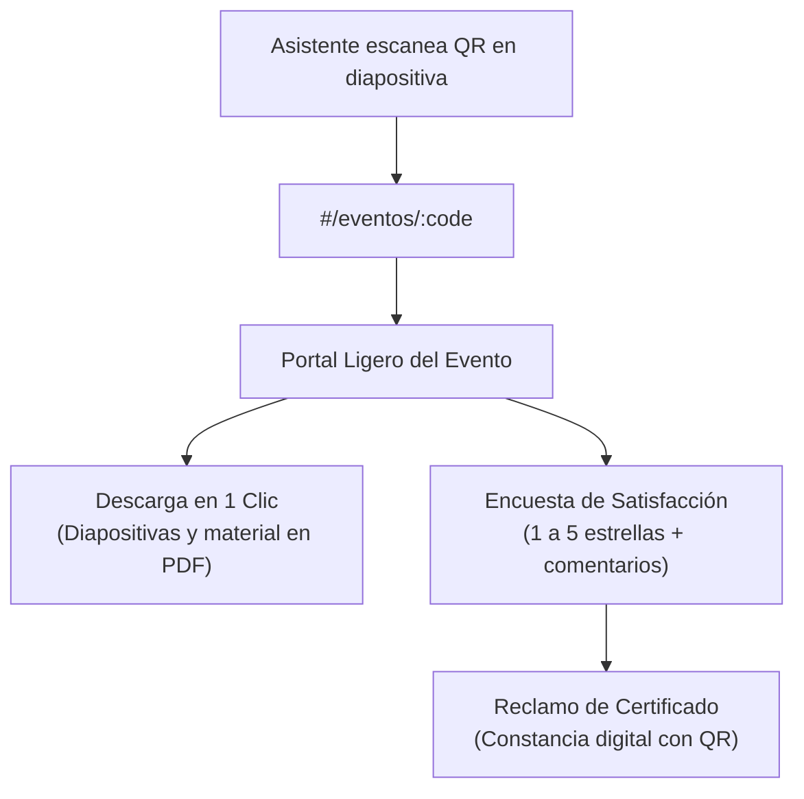
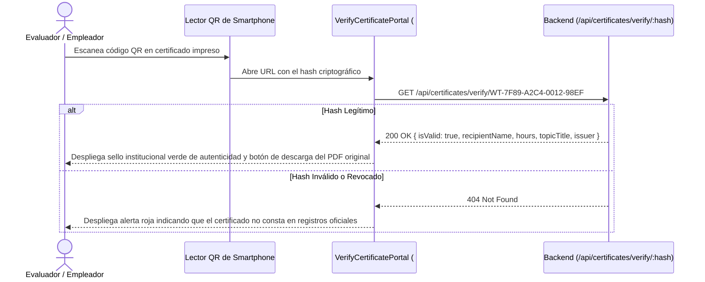

# Portales Públicos sin Autenticación

El sistema expone dos portales públicos de acceso directo que no requieren que el usuario posea una cuenta ni inicie sesión, garantizando máxima velocidad y cero fricción:

---

## 1. Portal Ligero de Eventos y Conferencias (`#/eventos/:code`)

### Propósito Operativo:
Diseñado específicamente para ser proyectado en pantallas gigantes durante charlas, seminarios y conferencias presenciales o virtuales organizadas por el Ing. Wilfrido Trujillo. Los asistentes escanean el código QR con la cámara de sus teléfonos inteligentes y aterrizan instantáneamente en esta vista ligera.

### Componentes Clave:
* **Tarjeta de Materiales:** Botón prominente de descarga directa de la presentación en PDF o guías complementarias.
* **Formulario Rápido de Calificación:** Escala interactiva de 1 a 5 estrellas y caja de comentarios opcionales. Al enviar, envía la petición a `POST /api/events/public/:code/feedback`.

---

## 2. Validador Público de Certificados Criptográficos (`#/certificados/validar/:hash`)

### Propósito Operativo:
Permite a reclutadores, empleadores, instituciones académicas o evaluadores de comités verificar la autenticidad formal de un certificado emitido por el Ing. Wilfrido Trujillo simplemente apuntando la cámara a la matriz QR impresa en la constancia física o digital.

### Elementos Visuales del Validador (`VerifyCertificatePortal.tsx`):
1. **Sello Oficial de Autenticidad:** Emblema con bordes esmeralda e indicador de certificación válida.
2. **Ficha Técnica del Titular:** Nombre del beneficiario en mayúsculas, cédula de identidad, horas de capacitación acreditadas y fecha de expedición.
3. **Firma y Responsable:** Certificación suscrita digitalmente por el Ing. Wilfrido Trujillo.
4. **Descarga de Evidencia:** Enlace directo para obtener una copia idéntica del archivo PDF oficial emitido.
