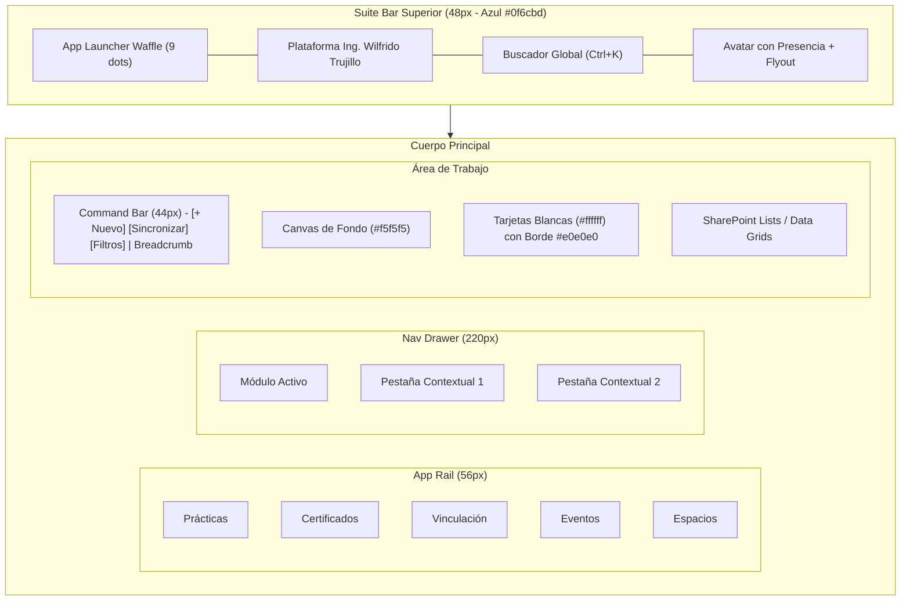

# Sistema de Diseño Microsoft 365 (Fluent Design System 2)

## 1. Fundamento y Filosofía de Diseño

La interfaz de usuario del proyecto `wilfrido_trujillo` adopta de manera estricta y exclusiva el **Fluent Design System 2 / Fluent UI v9** de **Microsoft 365**.

Este estándar emula la experiencia visual y operativa de las aplicaciones oficiales de productividad empresarial y educativa de Microsoft (**Microsoft Teams, SharePoint Online, OneDrive for Business, Outlook Web y Microsoft 365 Admin Center**).

### Principios Rectores:
1. **Rigor Corporativo e Institucional:** Eliminación absoluta de elementos lúdicos, efectos de neón, cajas con gradientes estridentes y modas estéticas pasajeras.
2. **Cero Emojis:** La comunicación es 100% tipográfica y vectorial sobria. Prohibido el uso de emojis en cualquier capa visual o de datos.
3. **Densidad de Información Útil:** La interfaz optimiza el espacio de trabajo para la gestión de expedientes académicos, auditoría documental de PDFs, calificación de pruebas y generación de certificados, evitando espacios vacíos innecesarios o métricas infladas.
4. **Claridad de Jerarquía y Superficie:** Fondo de aplicación neutro `#f5f5f5` sobre el cual destacan tarjetas y paneles en blanco puro `#ffffff` delimitados por bordes sutiles de 1 píxel (`#e0e0e0`) y sombras de elevación neutras.

---

## 2. Paleta Cromática Oficial Fluent 2 / Microsoft 365

El sistema cromático se basa en valores hexadecimales estandarizados por Microsoft. Ningún componente debe introducir colores no especificados en esta matriz:

### 2.1 Colores Primarios de Marca (Microsoft Blue Ribbon)
| Token de Diseño | Valor HEX | Uso Canónico |
| :--- | :--- | :--- |
| `colorBrandBackground` | `#0f6cbd` | Barra superior (Suite Bar), botones primarios de acción y enlaces activos. |
| `colorBrandBackgroundHover` | `#115ea3` | Estado hover de botones primarios y acciones destacadas. |
| `colorBrandBackgroundPressed` | `#0c3b5e` | Estado activo/clic de botones primarios. |
| `colorBrandBackground2` | `#ebf3fc` | Fondos de selección sutiles en menús laterales, pestañas activas y badges informativos. |
| `colorBrandForeground1` | `#0f6cbd` | Texto e iconografía activa sobre fondo blanco o seleccionado. |

### 2.2 Superficies y Lienzos (Neutral Backgrounds)
| Token de Diseño | Valor HEX | Uso Canónico |
| :--- | :--- | :--- |
| `colorNeutralBackground1` | `#ffffff` | Blanco puro: superficie de tarjetas (`Card`), modales, menús flotantes y celdas de tabla. |
| `colorNeutralBackground2` | `#f5f5f5` | Gris neutro claro: fondo global de la aplicación (Canvas de fondo). |
| `colorNeutralBackground3` | `#fafafa` | Gris tenue: cabeceras de tablas (`thead`), barras de comandos deshabilitadas y footers modales. |
| `colorNeutralBackground4` | `#f0f0f0` | Fondos de botones tenues (Subtle/Ghost) en hover y badges neutrales. |
| `colorSubtleHover` | `#f7f9fa` | Efecto hover interactivo sobre filas de tablas (`tr:hover`). |

### 2.3 Tipografía y Textos (Neutral Foregrounds)
| Token de Diseño | Valor HEX | Uso Canónico |
| :--- | :--- | :--- |
| `colorNeutralForeground1` | `#242424` | Texto principal: títulos, nombres de columna, cuerpo de lectura y valores tabulares. |
| `colorNeutralForeground2` | `#616161` | Texto secundario: metadatos, descripciones, labels de formularios y marcas de tiempo. |
| `colorNeutralForeground3` | `#8a8886` | Texto terciario: estados deshabilitados, marcas de agua y placeholder de inputs. |
| `colorNeutralForegroundStaticInverted` | `#ffffff` | Texto blanco puro: utilizado sobre la Suite Bar azul `#0f6cbd` y botones primarios. |

### 2.4 Bordes y Divisores (Neutral Strokes)
| Token de Diseño | Valor HEX | Uso Canónico |
| :--- | :--- | :--- |
| `colorNeutralStroke1` | `#d1d1d1` | Bordes interactivos de botones secundarios y campos de formulario en reposo. |
| `colorNeutralStroke2` | `#e0e0e0` | Borde estructural perimetral de tarjetas, paneles divisores y Command Bar. |
| `colorNeutralStrokeSubtle` | `#edebe9` | Divisores sutiles internos entre filas de tablas y separadores horizontales. |
| `colorBrandStroke1` | `#0f6cbd` | Borde de foco accesible (Focus visible) e indicador activo de la App Rail. |

### 2.5 Estados Semánticos y de Presencia
| Estado | Indicador / Texto | Fondo de Alerta / Badge | Uso en Plataforma |
| :--- | :--- | :--- | :--- |
| **Success / Disponible** | `#107c10` (Verde M365) | `#dff6dd` (Borde `#107c10/20`) | Certificados válidos, dictamen RRA favorable y presencia activa en avatar. |
| **Warning / Advertencia** | `#d83b01` (Naranja M365) | `#fff4ce` (Borde `#d83b01/20`) | Dictamen con observaciones normativas y advertencias de plazo de entrega. |
| **Danger / Crítico** | `#a80000` (Rojo M365) | `#fde7e9` (Borde `#a80000/20`) | Documento rechazado, intento fallido de cuestionario o error de servidor. |
| **Informational** | `#0f6cbd` (Azul M365) | `#ebf3fc` (Borde `#0f6cbd/20`) | En proceso de auditoría y estados preliminares de trámite. |

---

## 3. Tipografía Oficial y Escala de Texto

La tipografía sigue la pila nativa del sistema operativo corporativo de Microsoft:

```css
font-family: 'Segoe UI', 'Segoe UI Variable', -apple-system, BlinkMacSystemFont, Roboto, sans-serif;
```

### Escala de Jerarquía Tipográfica
| Nivel | Tamaño | Altura de Línea (Leading) | Peso | Clase Tailwind Equivalente |
| :--- | :--- | :--- | :--- | :--- |
| **Title 1** | `24px` | `32px` | Semibold (`600`) | `text-2xl font-semibold` |
| **Title 2** | `20px` | `26px` | Semibold (`600`) | `text-xl font-semibold` |
| **Subtitle** | `16px` | `22px` | Semibold (`600`) | `text-base font-semibold` |
| **Body 1 Strong** | `14px` | `20px` | Semibold (`600`) | `text-sm font-semibold` |
| **Body 1 Regular** | `14px` | `20px` | Regular (`400`) | `text-sm font-normal` |
| **Caption 1** | `12px` | `16px` | Regular (`400`) | `text-xs font-normal` |
| **Caption 2 (Micro)** | `10px` | `14px` | Semibold (`600`) | `text-[10px] font-semibold` |

---

## 4. Escala de Radios de Borde y Elevación (Sombras)

Fluent Design System 2 se caracteriza por una geometría sobria y contenida:

### 4.1 Radios de Borde (`border-radius`)
* **Radio Pequeño (`4px` / `rounded-[4px]`):** Botones de acción, campos de texto (`input`, `textarea`, `select`), chips y menús desplegables.
* **Radio Mediano (`8px` / `rounded-lg`):** Tarjetas de contenido (`Card`), contenedores de tablas y ventanas modales (`Modal`).
* **Radio Completo (`9999px` / `rounded-full`):** Badges de estado tipo píldora, indicadores de presencia y avatares circulares de usuario.
* **Prohibición:** Radios superiores a `12px` (estilo iOS/macOS) están vetados en la interfaz corporativa.

### 4.2 Sombras y Elevación
* **Elevación Nivel 1 (Cards & Paneles):** `box-shadow: 0 1px 3px rgba(0, 0, 0, 0.06);`
* **Elevación Nivel 2 (Menús Desplegables & Flyouts):** `box-shadow: 0 4px 16px rgba(0, 0, 0, 0.12);`
* **Elevación Nivel 3 (Diálogos Modales):** `box-shadow: 0 8px 28px rgba(0, 0, 0, 0.20);`

---

## 5. Arquitectura del Shell Microsoft 365 (`FluentShell.tsx`)

La composición de la pantalla responde a la cuadrícula fija de 4 áreas operativas:



### 5.1 Suite Bar Superior (48px)
* Fondo corporativo `#0f6cbd` con altura fija de `48px` (`h-12`).
* **App Launcher Waffle:** Botón cuadrado con icono de 9 puntos en matriz 3x3 que activa el `M365WaffleMenu.tsx`.
* **Buscador Central:** Anchura máxima de `460px` con fondo blanco al 15% (`bg-white/15`), texto blanco y atajo `Ctrl+K`. Al recibir foco, se expande a blanco puro con texto `#242424`.
* **Persona Flyout (`M365ProfileFlyout.tsx`):** Despliega el menú flotante oficial de cuenta de Microsoft 365, con punto de presencia verde `#107c10`, correo institucional, permisos evaluados y selector de rol PBAC.

### 5.2 Left App Rail (56px)
* Barra vertical blanca pura `#ffffff` con borde derecho `#e0e0e0`.
* Botones de 56px de ancho por 52px de alto.
* Disposición: icono de 20px arriba y etiqueta de texto en mayúsculas/minúsculas de 10px abajo.
* Elemento activo: fondo azul claro `#ebf3fc`, icono y texto en `#0f6cbd`, y barra vertical indicadora azul de 3px a la izquierda.

### 5.3 Secondary Navigation Drawer (220px)
* Panel contextual retráctil de navegación de segundo nivel correspondiente al módulo seleccionado.
* Botones de opción de 36px de altura con badges numéricos en píldora gris `#f0f0f0`.

### 5.4 Command Bar (44px)
* Barra blanca superior sobre el contenido con borde inferior `#e0e0e0`.
* Agrupa las acciones operativas directas (`+ Nuevo`, `Sincronizar`, `Filtro`) y muestra la ruta de migajas a la derecha.

---

## 6. Catálogo de Componentes de Interfaz

### 6.1 Tarjeta Estándar (`Card.tsx`)
```tsx
<div className="bg-white border border-[#e0e0e0] rounded-lg shadow-sm p-6">
  <div className="flex items-center justify-between border-b border-[#edebe9] pb-4 mb-4">
    <h3 className="text-base font-semibold text-[#242424]">Título de la Sección</h3>
    <span className="text-xs text-[#616161]">Subtítulo o Metadato</span>
  </div>
  <div className="text-sm text-[#242424] leading-relaxed">
    Contenido operativo del módulo...
  </div>
</div>
```

### 6.2 Data Grid Estilo SharePoint Lists / Lists M365
* Cabecera `<thead>` en gris claro `#fafafa` con texto en `#616161` de `12px font-semibold`.
* Filas `<tr>` con fondo `#ffffff`, bordes inferiores en `#edebe9`, y hover en `#f7f9fa`.
* Acciones en celda con botones sutiles (Subtle Button) de 32x32px.

### 6.3 Flujo Secuencial (Fluent Stepper)
* Empleado en el flujo de Prácticas Preprofesionales:
  1. Video de Inducción.
  2. Evaluación Diagnóstica.
  3. Formatos y Recursos Normativos.
  4. Buzón Oficial de Entrega y Dictamen RRA.
* Nodos circulares de 28px conectados por línea horizontal de 2px.

---

## 7. Tabla Comparativa de Anti-Patrones vs Solución M365

| Práctica Prohibida (Anti-Patrón) | Corrección Obligatoria Microsoft 365 |
| :--- | :--- |
| Usar emojis en títulos, botones o alertas (ej. 🎓, 📁, ⏳). | Usar tipografía clara e íconos vectoriales SVG lineales de 16px/20px. |
| Fondos negros, oscuros o modo consola cyberpunk. | Fondo Canvas `#f5f5f5` con tarjetas en blanco puro `#ffffff`. |
| Bloques de KPIs gigantes con números en 48px en la cabecera. | Información condensada en pestañas, badges y tablas de alta densidad. |
| Esquinas redondeadas masivas (16px a 24px estilo iOS). | Radio exacto de 4px para controles y 8px para tarjetas/modales. |
| Botones flotantes gigantescos en el medio de la pantalla. | Botones de acción contenidos en la Command Bar (`44px`) o cabeceras de tarjeta. |
| Cajas de simulación de rol flotando sobre la pantalla. | Gestión de identidad y cambio PBAC encapsulada en el `M365ProfileFlyout`. |
| Apilar todas las secciones verticalmente en una sola página larga. | Vistas modulares por pestañas y rutas hash independientes a pantalla completa. |
